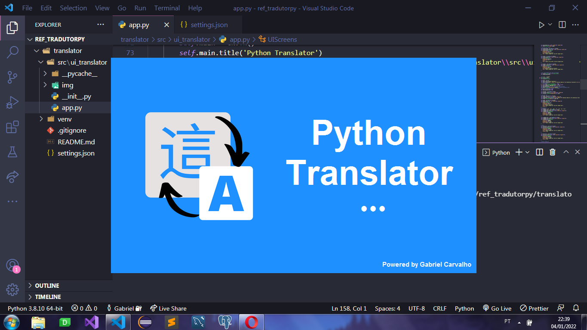
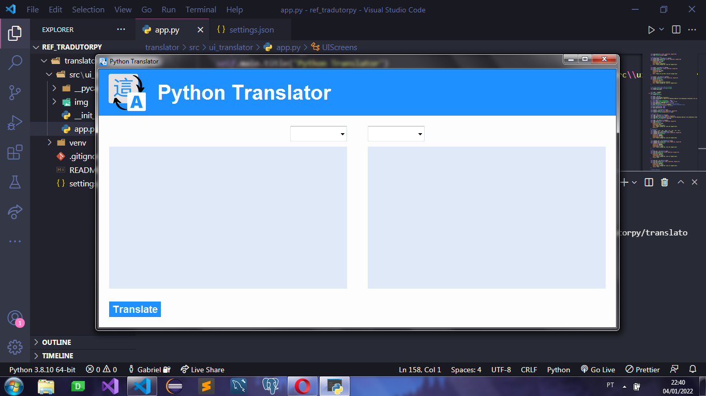

    <h1>Python translator</h1>
    <code></code>

### Python/tkinter

 
It's a desktop application made in python, (also, other version from an old project)
You can transtate to this languages:

>EN = english
>PT = portuguese 
>SPA = spanish
>FR = french
>ZH = chinese
>JA = japanese
>KO = korean

### Some screenshots

    
Splash Screen

    <code></code>
    
Main Screen

    <code></code>
    
Work

    <code></code>
    
Error handling

