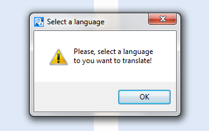

    <h1>Python translator</h1>
    <code></code>

### Python/tkinter

It's a desktop application made in python, (also, other version from an old project)
 
You can transtate to this languages:

>EN = english  
>PT = portuguese  
>SPA = spanish  
>FR = french  
>ZH = chinese  
>JA = japanese  
>KO = korean  

### Some screenshots

    
Splash Screen

    <code></code>
    
Main Screen

    <code></code>
    
Work

    <code></code>
    
Error handling

    <code></code>

